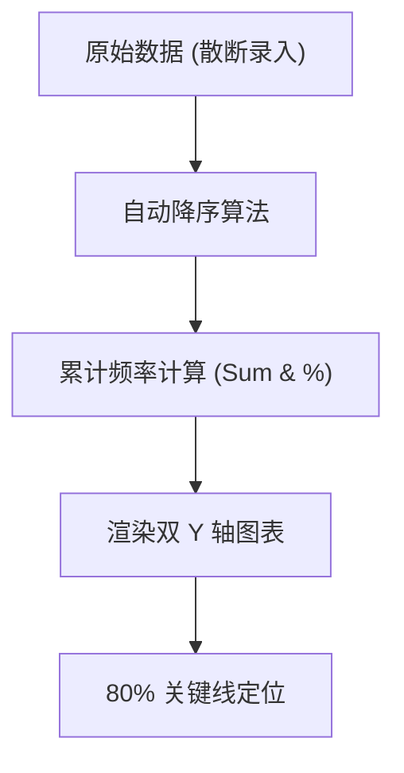

# Smart QC Studio DSL 权威指南 (V2.0)

> 本文档旨在为质量管理工程师、系统分析师及 AI 开发者提供 Smart QC Studio DSL (Domain Specific Language) 的全景式参考。通过这一套简洁的文本语言，您可以直接跨越绘图工具的繁琐操作，实现“描述即图表”。

---

## 1. 绪论 (Introduction)

### 1.1 为什么使用 DSL？
在工业级质量管理 (QC) 场景下，数据的准确性和逻辑的严密性至关重要。传统的拖拽式绘图工具存在以下缺陷：
- **一致性差**：多名工程师绘制的同类图表风格难以对齐。
- **修改成本高**：逻辑变更（如增加一个因果分支）往往导致全局图形重排。
- **无法与 AI 联动**：大型语言模型 (LLM) 更擅长生成结构化文本。

Smart QC Studio DSL 通过**声明式物理建模**解决了上述问题。您只需定义“有什么”，系统将自动根据工业美学标准决定“怎么画”。

### 1.2 核心理念
- **数据与表现分离**：DSL 指令专注于业务逻辑，渲染引擎专注于视觉呈现。
- **语义即逻辑**：语法设计贴合 QC 七大工具的经典思维模式。
- **多端联动**：同一套 DSL 可同时驱动手动录入表单、AI 推理引擎和高清 Canvas 画布。

---

## 2. 快速上手 (Getting Started)

### 2.1 五分钟入门示例
假设您需要分析一个简单的排列图（数据：物流 10, 破损 5, 其他 2）：

```pareto
#### 详细指令表
| 指令 | 作用 | 示例 | 默认值 |
| :--- | :--- | :--- | :--- |
| `Title:` | 设置主标题 | `Title: 售后数据分析` | - |
| `Decimals:` | 累计百分比小数点位数 | `Decimals: 2` | `1` |
| `Color[Bar]:` | 柱形演示 (Hex) | `Color[Bar]: #3b82f6` | - |
| `Color[Line]:` | 累计曲线颜色 (Hex) | `Color[Line]: #10b981` | - |
| `Color[MarkLine]:` | 80% 关键线颜色 (Hex) | `Color[MarkLine]: #ef4444` | - |
| `Color[Title]:` | 标题颜色 (Hex) | `Color[Title]: #ffffff` | - |
| `Font[Title]:` | 标题字号 (px) | `Font[Title]: 18` | - |
| `Font[Base]:` | 基础字号 (px) | `Font[Base]: 12` | - |
| `Font[Bar]:` | 柱形标签字号 (px) | `Font[Bar]: 10` | - |
| `Font[Line]:` | 曲线标签字号 (px) | `Font[Line]: 10` | - |

#### 数据项录入
- **格式**：`- [项目名称]: [频数]`
- **特性**：系统将自动对数据执行降序排列并计算累计贡献率率。无需手动排序。

### 2.2 编辑器交互
- **即时预览**：在 DSL 编辑器中输入文字时，右侧画布会执行毫秒级响应。
- **智能纠错**：若语法有误，界面会保留最后一次有效状态，并在控制台显示警告。

---

## 3. 通用指令大全 (Core Concepts)

通用的元数据指令适用于所有 10 个工具。

### 3.1 预定义基础变量
| 指令 | 作用域 | 示例值 | 说明 |
| :--- | :--- | :--- | :--- |
| `Title:` | 全局 | `注塑工艺分析` | 设置图表的主标题，通常居中显示。 |
| `Decimals:` | 全局 | `2` | 控制坐标轴和标签的小数点位数 (0-4)。 |
| `Font[Base]:` | 文本 | `12` | 设置坐标轴、图例、标签的全局基础字号。 |
| `Font[Title]:` | 标题 | `18` | 设置主标题的字号。 |

### 3.2 色彩配置模式 (Color Palette)
支持标准的 Hex 格式颜色值。
- `Color[Line]: #aaaaaa` (线缆、坐标轴)
- `Color[Text]: #333333` (主要文本)
- `Color[Mark]: #ef4444` (指示线、错误状态)

---

## 4. 逻辑与因果分析 (Logic & Causality)

### 4.1 鱼骨图 (Fishbone Diagram)
用于探寻问题的根源，通过层级结构展示人、机、料、法、环等维度。

#### 详细指令表
| 指令 | 作用 | 示例 | 默认值 |
| :--- | :--- | :--- | :--- |
| `Title:` | 定义鱼头核心问题 | `Title: 售后投诉根因分析` | `鱼骨图分析` |
| `Color[Root]:` | 鱼头矩形背景色 | `Color[Root]: #1e40af` | - |
| `Color[RootText]:` | 鱼头文字颜色 | `Color[RootText]: #ffffff` | - |
| `Color[Main]:` | 大骨分类背景色 | `Color[Main]: #2563eb` | - |
| `Color[MainText]:` | 大骨文字颜色 | `Color[MainText]: #ffffff` | - |
| `Color[Bone]:` | 主脊椎线颜色 | `Color[Bone]: #475569` | - |
| `Color[Line]:` | 子因连接线颜色 | `Color[Line]: #94a3b8` | - |
| `Color[Text]:` | 普通原因文字颜色 | `Color[Text]: #cbd5e1` | - |

#### 逻辑层级与数据录入
- **层级标记**：使用 `#` 数量代表深度。
  - `#` (一级大骨/类别)
  - `##` (二级中骨)
  - `###` (三级小骨)... 最高支持 6 级。
- **示例**：
  ```fishbone
  # 人 (Man)
  ## 技能欠缺
  ### 缺乏岗前培训
  ```

#### 实战范例
```fishbone
Title: 表面划痕故障分析
Color[Root]: #ef4444

# 人 (Man)
## 操作员疲劳
### 加班过多
## 技能培训不足

# 机 (Machine)
## 模具排气不良
## 导轨润滑失效
```

---

### 4.2 亲和图 / KJ法 (Affinity Diagram)
用于收集并发掘大量模糊性语言数据之间的内在联系。

#### 详细指令表
| 指令 | 作用 | 示例 | 默认值 |
| :--- | :--- | :--- | :--- |
| `Title:` | 图表标题 | `Title: 市场调研整理` | `亲和图` |
| `Type:` | 渲染模式 | `Type: Card` (卡片) / `Label` (标签) | `Card` |
| `Layout:` | 布局方向 | `Layout: Horizontal` / `Vertical` | `Horizontal` |
| `Color[TitleBg]:` | 标题背景色 | `Color[TitleBg]: #1e293b` | - |
| `Color[TitleText]:` | 标题文字色 | `Color[TitleText]: #ffffff` | - |
| `Color[GroupHeaderBg]:` | 分组头背景色 | `Color[GroupHeaderBg]: #334155` | - |
| `Color[GroupHeaderText]:` | 分组头文字色 | `Color[GroupHeaderText]: #ffffff` | - |
| `Color[ItemBg]:` | 卡片项背景色 | `Color[ItemBg]: #475569` | - |
| `Color[ItemText]:` | 卡片项文字色 | `Color[ItemText]: #ffffff` | - |
| `Color[Line]:` | 树状连线颜色 | `Color[Line]: #64748b` | - |
| `Color[Border]:` | 边框颜色 | `Color[Border]: #1e293b` | - |
| `Font[Title]:` | 标题字号 (px) | `Font[Title]: 24` | - |
| `Font[GroupHeader]:` | 分组字号 (px) | `Font[GroupHeader]: 16` | - |
| `Font[Item]:` | 项目字号 (px) | `Font[Item]: 12` | - |

#### 高级数据录入 (Legacy Spec)
亲和图采用显式 ID 定义层级关系，格式如下：
- **格式**：`Item: [ID], [Label], [ParentID/null]`
- **根节点固定 ID**：通常第一行为 `Item: root, [主题]`。
- **关联示例**：
  ```affinity
  Item: root, 产品优化
  Item: g1, 性能类, root
  Item: sub1, 响应超时, g1
  ```

#### 实战范例
```affinity
Title: 研发效能提升方案
Type: Card
Layout: Horizontal

# 流程优化
## 简化审批链条
## 引入自动化测试
# 团队建设
## 增加技术分享课
## 完善季度考核
```

---

### 4.3 关联图 (Relation Diagram)
解决多因素交织、非线性的因果网络分析。

#### 详细指令表
| 指令 | 作用 | 示例 | 默认值 |
| :--- | :--- | :--- | :--- |
| `Title:` | 主要症结（根节点） | `Title: 客服满意度提升` | `关联图` |
| `Layout:` | 布局模式 | `Centralized`/`Directional`/`Free` | `Directional` |
| `Node:` | 定义因素节点 | `Node: m1, 服务响应慢` | - |
| `Rel:` | 定义因果指向 | `Rel: e1 -> m1` | - |
| `Color[Root]:` | 根节点背景色 | `Color[Root]: #dbeafe` | - |
| `Color[Middle]:` | 中间因素背景色 | `Color[Middle]: #f3e8ff` | - |
| `Color[End]:` | 末端因素背景色 | `Color[End]: #fff1f2` | - |
| `Color[Line]:` | 连线颜色 | `Color[Line]: #94a3b8` | - |
| `Font[Title]:` | 标题字号 (px) | `Font[Title]: 20` | - |
| `Font[Node]:` | 节点字号 (px) | `Font[Node]: 12` | - |

#### 逻辑特性
- **方向性**：`source -> target` 表示 source 是 target 的原因。
- **自动分类**：入度为 0 的节点被视为“末端因素 (End)”；有入有出的节点为“中间因素 (Middle)”。
- **虚根连接**：系统会自动将顶级因素连接至 `Title` 所定义的根节点。
- **循环检测**：关联图不允许存在闭环路径（A -> B -> A），否则系统会给出错误提示。

#### 实战范例
```relation
Title: 良率波动因素网
Layout: Centralized

Node: n1, 温度波动
Node: n2, 压力不稳
Node: n3, 模具精度下降
Node: n4, 润滑失效

Rel: n3 -> n1
Rel: n4 -> n1
Rel: n1 -> n2
```

---

### 4.4 PDPC (过程决策程序图)
分析实现目标的过程中的风险及应对措施。

#### 详细指令表
| 指令 | 作用 | 示例 | 默认值 |
| :--- | :--- | :--- | :--- |
| `Title:` | 计划/目标描述 | `Title: 新系统切换计划` | - |
| `Layout:` | 布局风格 | `Directional`(流图) / `Standard`(树状) | `Standard` |
| `Group:` | 开始分组 (阶段) | `Group: g1, 准备阶段` | - |
| `EndGroup` | 结束当前分组 | `EndGroup` | - |
| `Item:` | 定义节点 | `Item: n1, 备份数据, [start]` | - |
| `Color[Start]:` | 起点背景色 | `Color[Start]: #10b981` | - |
| `Color[Step]:` | 过程步骤背景色 | `Color[Step]: #3b82f6` | - |
| `Color[Countermeasure]:` | 风险对策背景色 | `Color[Countermeasure]: #f59e0b` | - |
| `Color[End]:` | 终点背景色 | `Color[End]: #ef4444` | - |
| `Line[Width]:` | 线条粗细 (px) | `Line[Width]: 2` | `2` |

#### 路径与标记 (OK/NG)
- **连线格式**：`id1--id2` (支持链式：`id1--id2--id3`)
- **状态标记**：在行末添加 `[OK]` 或 `[NG]` 标记逻辑分支。
  - `OK`：正常预期路径，通常指向下一个 `Step` 或 `End`。
  - `NG`：风险路径，通常指向 `Countermeasure`。
- **示例**：
  ```pdpc
  CheckData--Repair [NG]
  CheckData--Proceed [OK]
  ```

#### 节点类型定义
在 `Item:` 指令的第三个参数指定：`[start]`, `[step]`, `[countermeasure]`, `[end]`。

#### 实战范例
```pdpc
Title: 系统上线应急方案
Layout: Directional

Group: g1, 发布流程
  Item: s1, 环境检查, [start]
  Item: s2, 镜像推送
  Item: s3, 自动化测试
EndGroup

Group: g2, 应急响应
  Item: c1, 回滚代码, [countermeasure]
  Item: c2, 通知运维, [countermeasure]
EndGroup

s1--s2--s3
s3--end [OK]
s3--c1 [NG]
c1--c2
```

---

## 5. 统计分析工具 (Statistical Analysis)

### 5.1 排列图 (Pareto Chart)
基于“二八定律”，用于识别影响质量的关键少数因素。系统自动执行数据降序排列并计算累计百分比。

#### 语法规范
- **数据项**：`- [项目名称]: [频数]` (无需手动排序)
- **特定样式**：
  - `Color[Bar]`: 柱条颜色
  - `Color[Line]`: 累计百分比曲线颜色
  - `Color[MarkLine]`: 80% 参考线颜色

#### 逻辑模型 (Mermaid)


#### 实战范例
```pareto
Title: 2024年12月质量缺陷分析
Decimals: 1
Color[Bar]: #3b82f6

- 表面划痕: 145
- 尺寸超差: 42
- 杂质包裹: 18
- 其他: 5
```

---

### 5.2 分布直方图 (Histogram)
分析连续型数据的分布形态，并评价其与规格限 (USL/LSL) 的符合程度。

#### 详细指令表
| 指令 | 作用 | 示例 | 默认值 |
| :--- | :--- | :--- | :--- |
| `Title:` | 图表主标题 | `Title: 钢管直径分布` | - |
| `USL:` | 规格上限 (Upper Limit) | `USL: 12.5` | - |
| `LSL:` | 规格下限 (Lower Limit) | `LSL: 10.0` | - |
| `Target:` | 目标值 (Target Value) | `Target: 11.25` | - |
| `Bins:` | 分组数量 | `Bins: 20` 或 `Bins: auto` | `auto` |
| `ShowCurve:` | 是否显示正态分布曲线 | `ShowCurve: true` | `false` |
| `Color[Bar]:` | 直方柱展示颜色 | `Color[Bar]: #6366f1` | - |
| `Color[Curve]:` | 正态曲线颜色 | `Color[Curve]: #indigo-400` | - |
| `Color[USL]:` | 上限线颜色 | `Color[USL]: #ef4444` | - |
| `Color[LSL]:` | 下限线颜色 | `Color[LSL]: #ef4444` | - |
| `Color[Target]:` | 目标线颜色 | `Color[Target]: #10b981` | - |

#### 数据项录入
- **格式**：`- [数值]` (支持负数与浮点数)
- **注意**：仅支持单列数值输入，每行一个数据点。
- **注释**：支持以 `#` 开头的行作为注释，解析时将被忽略。

#### 实战范例
```histogram
Title: 轴承外径分布分析
USL: 10.05
LSL: 9.95
Target: 10.00
ShowCurve: true

- 10.01
- 9.98
- 10.02
- 9.97
- 10.00
```

---

### 5.3 散点图 (Scatter Plot)
用于研究两个或三个变量之间的相关性强度。

#### 详细指令表
| 指令 | 作用 | 示例 | 默认值 |
| :--- | :--- | :--- | :--- |
| `Title:` | 图表主标题 | `Title: 散力分布研究` | - |
| `XAxis:` | X 轴名称 | `XAxis: 压力 (MPa)` | - |
| `YAxis:` | Y 轴名称 | `YAxis: 形变量` | - |
| `ZAxis:` | Z 轴名称 (仅 3D/气泡) | `ZAxis: 温度` | - |
| `Color[Point]:` | 散点背景色 | `Color[Point]: #3b82f6` | - |
| `Color[Trend]:` | 趋势线颜色 | `Color[Trend]: #ef4444` | - |
| `ShowTrend:` | 是否显示回归线 | `ShowTrend: true` | `false` |
| `3D:` | 启用 3D 视图 | `3D: true` | `false` |
| `Size[Base]:` | 基础点大小 (px) | `Size[Base]: 10` | `10` |
| `Opacity:` | 点透明度 (0-1) | `Opacity: 0.6` | `0.8` |

#### 数据录入
- **格式**：`- X, Y, [Z]`
- **说明**：在 3D 模式下，Z 用于深度坐标；在 2D 气泡图模式下，Z 可用于控制气泡大小。

#### 实战范例
```scatter
Title: 烧结温度与硬度关系研究
XAxis: 温度 (℃)
YAxis: 洛氏硬度 (HRC)
ShowTrend: true

- 850, 42
- 860, 45
- 870, 48
- 880, 52
```

---

### 5.4 控制图 (Control Chart)
SPC 核心工具，用于监测过程稳定性。

#### 详细指令表
| 指令 | 作用 | 示例 | 默认值 |
| :--- | :--- | :--- | :--- |
| `Title:` | 图表主标题 | `Title: 尺寸 SPC 控制` | - |
| `Type:` | 图表类型 | `I-MR`/`X-bar-R`/`P`/`C` 等 | `X-bar-R` |
| `Size:` | 子组容量 (n) | `Size: 5` | `1` |
| `Rules:` | 判异规则列表 | `Rules: Nelson, Basic` | `Basic` |
| `Decimals:` | 精度位数 | `Decimals: 3` | `2` |
| `UCL:` | 手动指定控制上限 | `UCL: 10.5` | (自动计算) |
| `LCL:` | 手动指定控制下限 | `LCL: 9.5` | (自动计算) |
| `CL:` | 手动指定中心线 | `CL: 10.0` | (自动计算) |
| `Color[Line]:` | 折线演示 | `Color[Line]: #3b82f6` | - |
| `Color[Point]:` | 节点演示 | `Color[Point]: #1d4ed8` | - |
| `Color[UCL]:` | 警告线颜色 | `Color[UCL]: #ef4444` | - |

#### 数据序列语法
使用 `[series]` 块定义多维或单维序列：
```control
[series]: 数据组名称
12.1, 12.3, 12.2, 12.5, 12.4
[/series]
```

#### 实战范例
```control
Title: 轴直径控制 (X-bar-R)
Type: X-bar-R
Size: 5
Rules: Nelson

[series]:
10.01, 10.02, 9.99, 10.00, 10.01
10.03, 9.98, 10.01, 10.02, 9.99
[/series]
```

---

## 6. 矩阵分析工具 (Matrix Analysis)

### 6.1 矩阵图 (Matrix Diagram)
通过 L、T、Y、X、C 等多型矩阵分析两组或多组元素间的关联。

#### 详细指令表
| 指令 | 作用 | 示例 | 默认值 |
| :--- | :--- | :--- | :--- |
| `Title:` | 图表主标题 | `Title: 客户需求矩阵` | `矩阵图分析` |
| `Type:` | 矩阵构型 | `L`/`T`/`Y`/`X`/`C` | `L` |
| `Axis:` | 定义轴 | `Axis: A, 用户需求` | - |
| `Matrix:` | 定义坐标系 | `Matrix: A x B` | - |
| `ShowScores:` | 显示计算得分 | `ShowScores: true` | `false` |
| `Weight[Strong]:`| 强关联权重 | `Weight[Strong]: 9` | `9` |
| `Weight[Medium]:`| 中关联权重 | `Weight[Medium]: 3` | `3` |
| `Weight[Weak]:`  | 弱关联权重 | `Weight[Weak]: 1` | `1` |
| `CellSize:` | 单元格像素大小 | `CellSize: 40` | `40` |

#### 数据项定义
在 `Axis:` 指令下使用 `-` 符号列出：
- **格式**：`- [ID], [标签], [自重]`
- **示例**：`- a1, 响应速度, 5`

#### 关系映射语法
在 `Matrix: A x B` 声明下方编写交点关系：
- **格式**：`行ID: 列ID1:符号, 列ID2:符号`
- **默认符号**：`◎` (强), `○` (中), `△` (弱)。也支持短代码 `S`, `M`, `W` 或数字 `9`, `3`, `1`。
- **示例**：`a1: b1:◎, b2:○`

#### 实战范例 (L型)
```matrix
Title: 用户需求与技术特性矩阵 (L型)
Type: L
CellSize: 50
ShowScores: true

Axis: A, 用户需求
- a1, 易学性, 5
- a2, 响应速度, 4

Axis: B, 技术特性
- b1, UI简洁度, 5
- b2, 算法效率, 4

Matrix: A x B
a1: b1:◎
a2: b2:◎, b1:○
```

---

### 6.2 矩阵数据分析图 (Matrix Plot)
对多元数据进行可视化呈现，支持多种统计平滑。

#### 详细指令表
| 指令 | 作用 | 示例 | 默认值 |
| :--- | :--- | :--- | :--- |
| `Mode:` | 展示模式 | `Matrix` (变量矩阵) / `YvsX` (交叉比较) | `Matrix` |
| `Dimensions:` | 分析维度 (Matrix) | `Dimensions: [温, 压, 效]` | - |
| `X-Dimensions:`| X 轴集合 (YvsX) | `X-Dimensions: [A, B]` | - |
| `Y-Dimensions:`| Y 轴集合 (YvsX) | `Y-Dimensions: [C, D]` | - |
| `Group:` | 分组变量名 | `Group: 工段` | - |
| `Smoother:` | 平滑算法 | `Lowess` / `MovingAverage` / `false` | `false` |

#### 数据块定义 (Data:)
使用 YAML-lite 对象列表录入原始样本：
```matrixplot
Data:
- { Temp: 200, Yield: 85, Group: "A" }
- { Temp: 210, Yield: 88, Group: "B" }
```

#### 样式块定义 (Styles:)
```matrixplot
Styles:
- DisplayMode: Full / Lower / Upper
- Diagonal: Histogram / Boxplot / Label / None
- PointSize: 6
- PointOpacity: 0.8
```
#### 实战范例
```matrixplot
Title: 多因子质量分布矩阵
Mode: Matrix
Dimensions: 温度, 压力, 硬度
Smoother: Lowess

Data:
- 850, 120, 42
- 860, 125, 45
- 870, 118, 48
```

---

## 6.3 矢线图 (Arrow Diagram)
又称网络计划图 (PERT/CPM)，用于安排项目进度，识别关键路径。

### 详细指令表
| 指令 | 作用 | 示例 | 默认值 |
| :--- | :--- | :--- | :--- |
| `Title:` | 项目标题 | `Title: 新品发布计划` | `矢线图` |
| `ShowCritical:` | 标记关键路径 | `ShowCritical: true` | `true` |
| `Event:` | 定义节点(事件) | `Event: 1, 开工` | - |
| `Color[Node]:` | 节点填充色 | `Color[Node]: #ffffff` | - |
| `Color[Line]:` | 普通路径颜色 | `Color[Line]: #64748b` | - |
| `Color[Critical]:` | 关键路径颜色 | `Color[Critical]: #ef4444` | - |

### 逻辑关系语法
- **实活动**：`Source -> Target : Duration, Label`
  - 表示需要消耗时间和资源的实际作业。
  - 示例：`1 -> 2 : 5, 需求调研` (从节点1到2，耗时5天)。
- **虚活动**：`Source ..> Target`
  - 表示仅有逻辑约束关系，不消耗资源的作业（Duration=0，虚线）。
  - 示例：`2 ..> 3`

### 实战范例
```arrow
Title: 软件开发进度网络图
ShowCritical: true

# 定义里程碑 (可选)
Event: 1, 项目启动
Event: 6, 项目结束

# 定义活动路径 (前置 -> 后置 : 天数, 内容)
1 -> 2 : 5, 需求分析
2 -> 3 : 10, 架构设计
2 -> 4 : 5, UI设计
3 -> 5 : 15, 后端开发
4 -> 5 : 10, 前端开发
5 -> 6 : 5, 联调测试
```

---

## 7. 附录 (Appendix)

### 7.1 常见问题 (FAQ)
- **Q: 为什么输入 DSL 后图表没有变化？**
  - A: 请检查是否存在语法错误，或是否漏掉了必填的 `Title:` 指令。
- **Q: 颜色支持哪些格式？**
  - A: 当前主要支持 Hex 格式（如 `#ff0000`）。

### 7.2 核心限制
- 单词长度建议不超过 20 个字符，以防在手机端溢出。
- 控制图的数据子组大小 `Size` 必须与 `[series]` 中的实际点数匹配。
