# 《Smart QC Tools Mermaid 绘图引擎》使用手册
**（软件著作权申请建议参考文档版本）**

---

## 1. 软件概述

### 1.1 软件名称及版本
**软件名称**：Smart QC Tools 工业级质量控制软件  
**版本号**：V1.0  
**功能模块**：Mermaid 逻辑绘图模块（核心模块）

### 1.2 开发背景与用途
Mermaid 模块旨在为质量管理和敏捷开发团队提供一种“代码即图形”的高效解决方案。通过集成全球领先的 Mermaid.js 开源引擎，本软件实现了从结构化文本驱动到专业图表的快速转换。模块支持流程图、甘特图、序列图、状态图等多种工业标准图表，并结合 AI 推理能力，大幅降低了复杂逻辑可视化的门槛。

---

## 2. 软件运行环境

### 2.1 硬件环境
- **处理器**：双核 2.0GHz 或更高
- **内存**：4GB 以上
- **硬盘**：可用空间 500MB 以上

### 2.2 软件环境
- **操作系统**：Windows 10/11, macOS, Linux
- **内核驱动**：React + Mermaid.js 渲染引擎
- **浏览器**：Chrome 90+, Edge, Safari

---

## 3. 核心功能及操作规程

### 3.1 模块界面入口
位于侧边栏或仪表盘的 **“Mermaid Logic”** 入口。界面采用工业级三段式布局：左侧为控制面板，中间为实时预览，工具栏提供缩放与导出功能。

---

### 3.2 侧边栏控制面板 (Control Hub)

#### 3.2.1 外观样式 (Appearance)
- **配置内容**：包括图表标题、内置主题（Default, Forest, Dark, Neutral）、画布背景颜色及全局字号设置。
- **联动特性**：样式修改后，绘图区将实时触发重绘，确保视觉一致性。

#### 3.2.2 代码编辑 (DSL Editor)
- **语法支持**：完全兼容 Mermaid.js 标准语法。
- **即时渲染**：支持一边编写一边预览。采用防抖优化，在大规模图形渲染时依然保持流畅。

#### 3.2.3 AI 智能生成 (AI Generation)
- **操作方式**：用户只需描述业务逻辑（例如：“画一个 CRM 系统的客户线索流转过程”），AI 即可自动生成对应的 Mermaid 源码并自动排图。

---

### 3.3 画布交互与工具栏 (Canvas Tools)

- **自适应缩放 (Auto-fit)**：图形生成后，系统会自动计算最佳比例，将其完整显示在当前视口中心。
- **自由缩放平移**：支持鼠标滚动缩放及按住空格/鼠标右键进行画布平移，方便查看复杂长图。
- **工业级导出**：支持导出白底/透明 PNG 以及矢量 PDF 文档。

---

## 4. 常见 Mermaid 语法参考

### 4.1 流程图 (Flowchart)
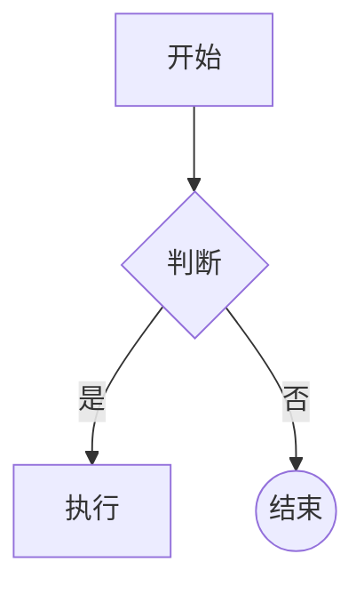

### 4.2 甘特图 (Gantt)
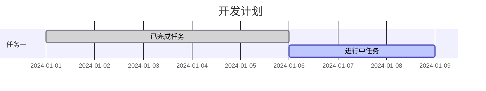

### 4.3 思维导图 (Mindmap)
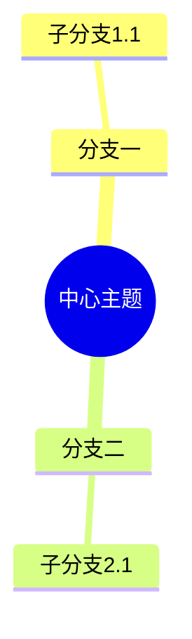

### 4.4 看板图 (Kanban)
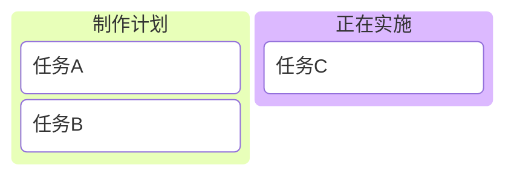

### 4.5 序列图 (Sequence)
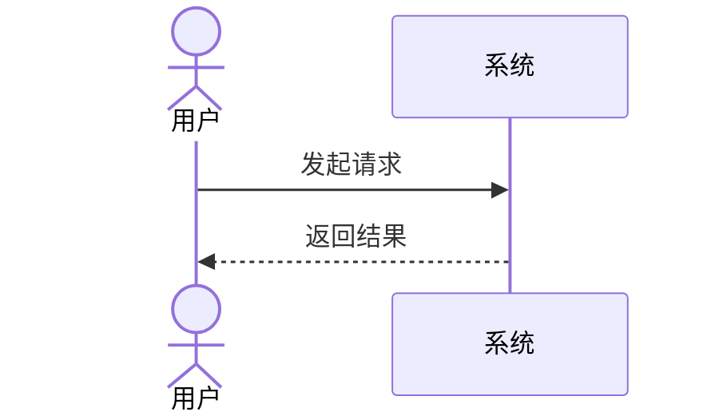

### 4.6 状态图 (State)
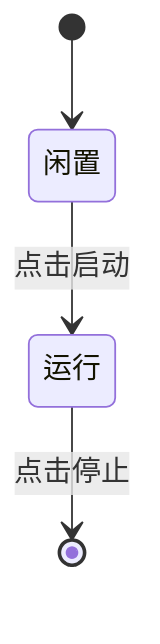

### 4.7 饼图 (Pie)
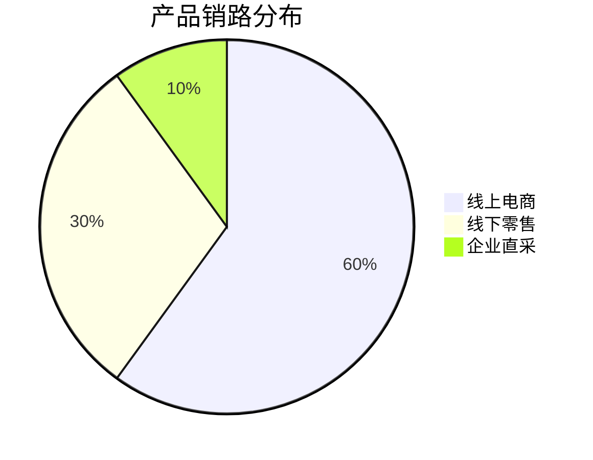

### 4.8 类图 (Class)
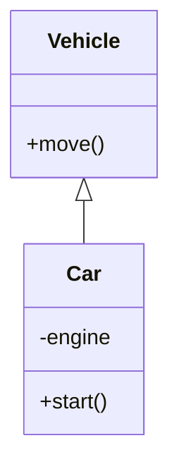

### 4.9 实体关系图 (ER)
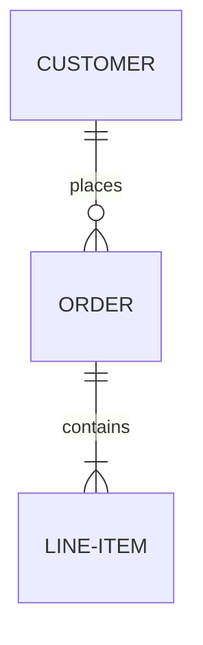

### 4.10 用户旅程图 (Journey)
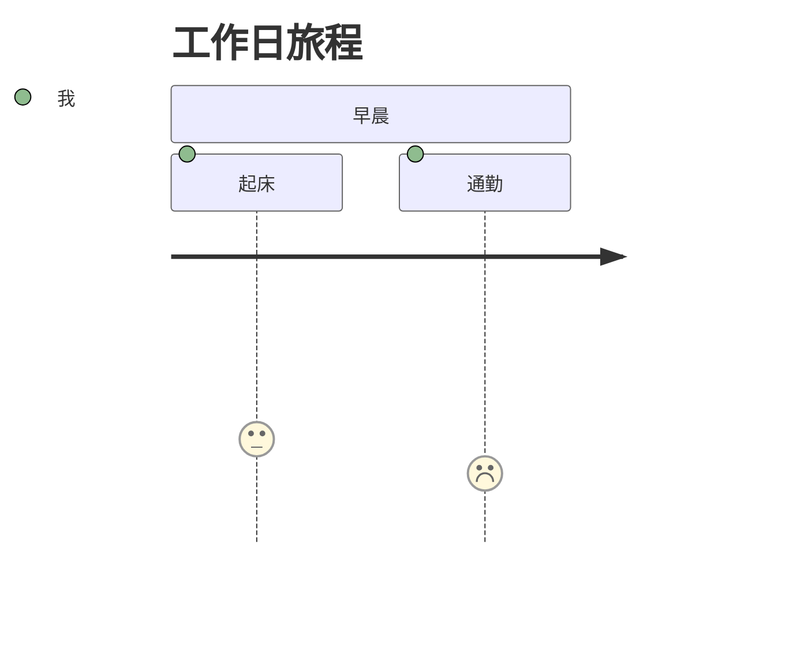

### 4.11 时间线图 (Timeline)
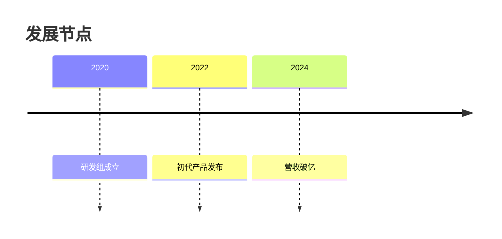

---

## 5. AI 生成最佳实践 (AI Hub)

为了确保 AI 生成的图表 100% 可用，建议遵循以下规范：

- **描述清晰**：提供具体层级关系（如“按人机料法环展开”）。
- **中文标点**：AI 会自动在描述中使用中文标点（，。？！），这能有效避免语法冲突。
- **强制包裹**：对于包含空格的内容，建议显式提示 AI 使用引号包裹。

---

## 6. 技术性能与优化

- **O(1) 样式映射**：通过 React State 同步机制，实现了样式变更对渲染引擎的毫秒级注入。
- **自研视图包络算法**：通过解析 SVG ViewBox，动态调节 transform 矩阵，解决了 Mermaid 默认生成的 SVG 溢出容器的问题。
- **AI 语义对齐**：通过预置 `mermaid` 专用 Prompt 协议，确保 AI 输出的语法 100% 正确。

---
*版本日期：2026年2月*  
* Smart QC Tools 研发组*
