# Obsidian中的Mermaid培训教程

## 课程概述

本教程专为Obsidian用户设计，旨在帮助学员掌握在Obsidian环境中使用Mermaid绘制各种图表的技能。作为Obsidian培训课程的重要子课程，本教程将通过理论学习与实践操作相结合的方式，让学员从零基础逐步成长为熟练的图表绘制者。

### 学习目标

- 掌握Mermaid的基本概念和语法
- 熟练在Obsidian中配置和使用Mermaid
- 能够绘制常用的流程图、思维图、甘特图等
- 学会应用高级功能进行图表定制
- 掌握图表设计的最佳实践
- 能够在实际工作中应用所学技能

### 课程特色

- **渐进式学习**：从基础到高级，循序渐进
- **实践导向**：每个知识点都配有实际操作练习
- **Obsidian集成**：专门针对Obsidian环境优化
- **案例丰富**：提供大量实用的图表模板
- **即学即用**：学完即可应用到实际工作中

## 第一阶段：基础概念理解（90分钟）

### 1.1 理解Mermaid概念与优势（30分钟）

#### 什么是Mermaid？

Mermaid是一个基于JavaScript的图表绘制工具，允许用户通过简单的文本语法来创建各种类型的图表和图形。它的核心优势在于：

- **文本驱动**：使用简单的文本语法，无需拖拽操作
- **版本控制友好**：纯文本格式，易于版本管理
- **快速绘制**：比传统绘图工具更快速
- **多平台支持**：广泛集成于各种平台和工具

#### Mermaid在Obsidian中的价值

- **知识可视化**：将复杂概念以图表形式展现
- **思维整理**：通过图表梳理思路和逻辑关系
- **文档增强**：为笔记添加专业的图表说明
- **协作沟通**：便于与他人分享和讨论

#### 实践练习
创建第一个简单的Mermaid图表，体验文本到图形的转换过程。

### 1.2 认识各种图表类型（30分钟）

#### 主要图表类型介绍

1. **流程图（Flowchart）**
   - 用途：描述流程、决策逻辑
   - 特点：有向图，包含决策节点

2. **思维图（Mindmap）**
   - 用途：知识结构梳理、创意发散
   - 特点：树状结构，中心主题扩散

3. **甘特图（Gantt）**
   - 用途：项目进度管理、时间规划
   - 特点：时间轴显示，任务依赖关系

4. **看板图（Kanban）**
   - 用途：任务管理、工作流程可视化
   - 特点：列式布局，任务状态跟踪

5. **序列图（Sequence Diagram）**
   - 用途：系统交互描述、API流程
   - 特点：时序性，对象间消息传递

#### 选择图表类型的原则
- 根据要表达的内容性质选择
- 考虑受众的理解习惯
- 匹配具体的使用场景

### 1.3 掌握基本语法规则（30分钟）

#### Mermaid语法基础

##### 代码块格式
```
	```mermaid
	图表类型声明
	图表内容
	```
```

##### 通用语法规则
- 每行一个语句
- 使用`-->`表示连接
- 使用`[]`、`()`、`{}`等符号定义节点形状
- 支持中文内容

#### 实践练习
练习基本语法，创建简单的流程图示例。

## 第二阶段：Obsidian环境配置（60分钟）

### 2.1 Obsidian软件安装配置（20分钟）

#### 系统要求
- Windows 10+、macOS 10.15+、Linux
- 4GB RAM（推荐8GB）
- 500MB可用存储空间

#### 安装步骤
1. 访问Obsidian官网下载对应版本
2. 运行安装程序
3. 创建或打开保管库（Vault）
4. 完成初始设置

#### 基础配置
- 设置界面语言为中文
- 配置文件存储位置
- 调整编辑器外观设置

### 2.2 Mermaid功能启用设置（15分钟）

#### 原生支持确认
Obsidian原生支持Mermaid，无需额外安装插件即可使用。

#### 启用步骤
1. 打开设置（Settings）
2. 进入"核心插件"（Core plugins）
3. 确认Mermaid功能已启用
4. 测试基本功能

#### 渲染设置
- 调整图表显示大小
- 设置默认主题样式
- 配置渲染参数

### 2.3 相关插件推荐安装（25分钟）

#### 推荐插件列表

1. **Mermaid Tools**
   - 功能：提供Mermaid图表模板和快捷工具
   - 安装：社区插件市场搜索安装
   - 配置：设置常用模板

2. **Mermaid Themes**
   - 功能：提供更多主题样式选择
   - 特点：可自定义图表外观

3. **Advanced Tables**
   - 功能：增强表格编辑功能
   - 与Mermaid互补使用

#### 插件安装方法
1. 进入设置 → 社区插件
2. 关闭安全模式
3. 浏览插件市场
4. 搜索并安装所需插件
5. 启用插件并进行配置

## 第三阶段：基本图表类型学习（150分钟）

### 3.1 流程图（Flowchart）绘制（45分钟）

#### 流程图基础语法

##### 方向声明
```
	```mermaid
	flowchart TD  %% 从上到下
	flowchart LR  %% 从左到右
	flowchart RL  %% 从右到左
	flowchart BT  %% 从下到上
	```
```

##### 节点定义
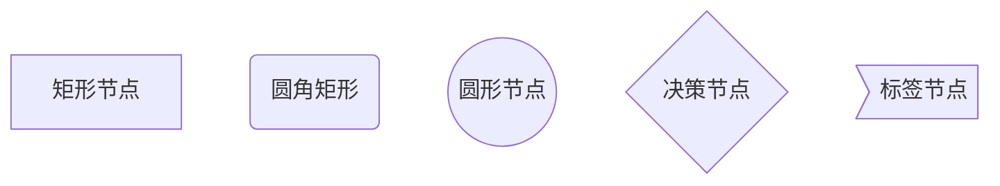

##### 连接语法
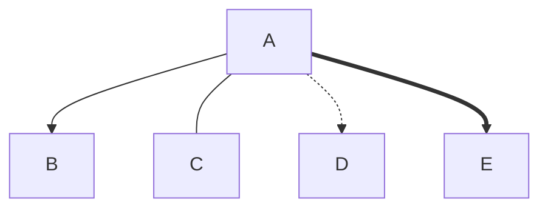

#### 实际案例：项目审批流程

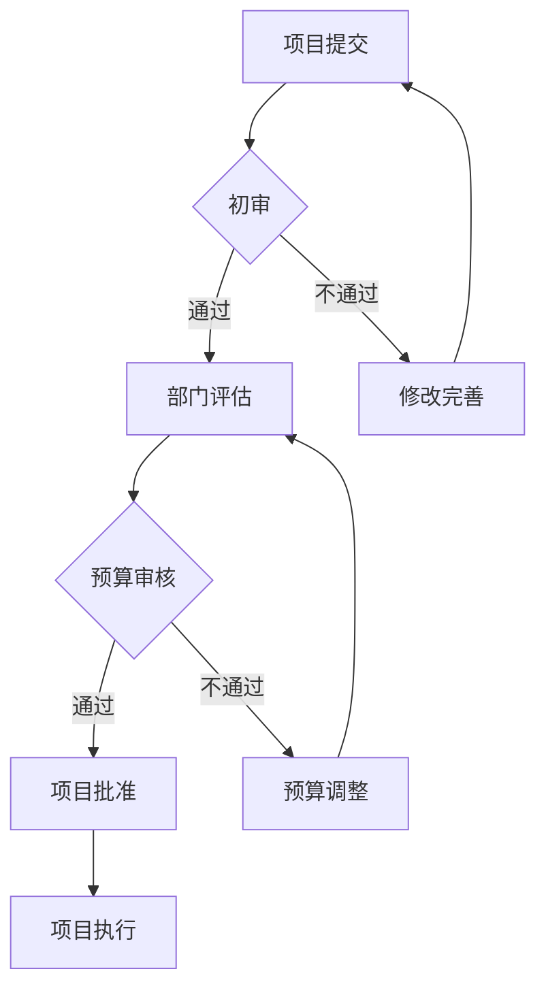

#### 练习任务
1. 绘制个人学习计划流程图
2. 创建工作流程图
3. 设计决策树图表

### 3.2 思维图（Mindmap）制作（40分钟）

#### 思维图语法基础

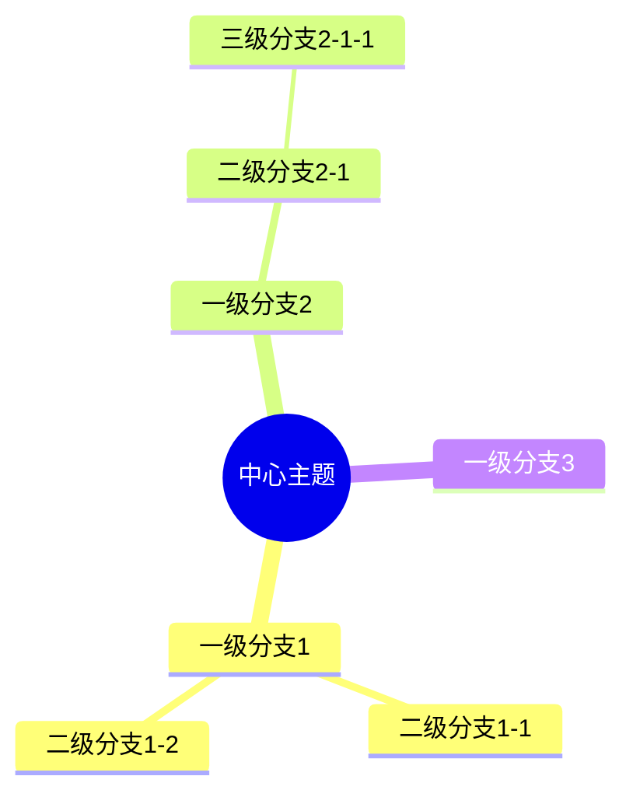

#### 节点形状语法
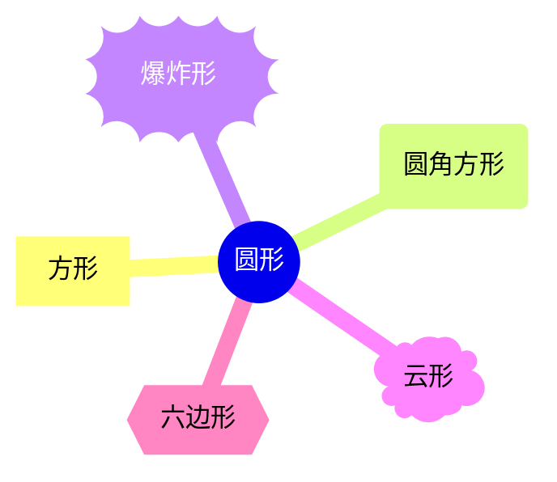

#### 实际案例：知识管理体系

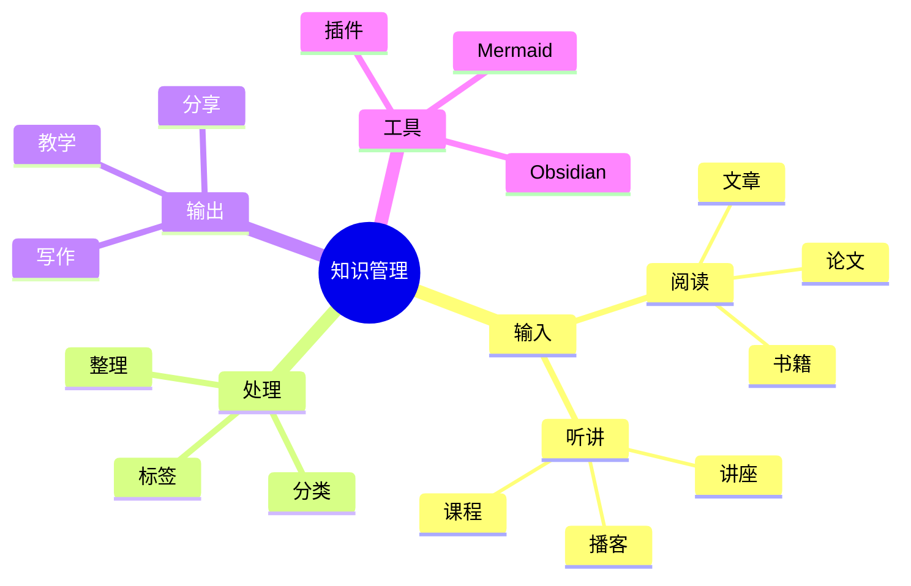

#### 练习任务
1. 创建专业技能思维图
2. 绘制项目计划思维图
3. 制作学习目标分解图

### 3.3 甘特图（Gantt）应用（35分钟）

#### 甘特图基础语法

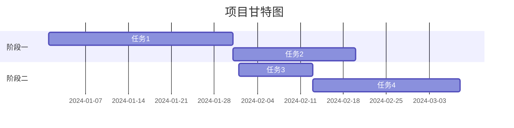

#### 高级功能
- 任务依赖关系
- 里程碑设置
- 关键路径标注
- 完成状态显示

#### 实际案例：培训项目进度

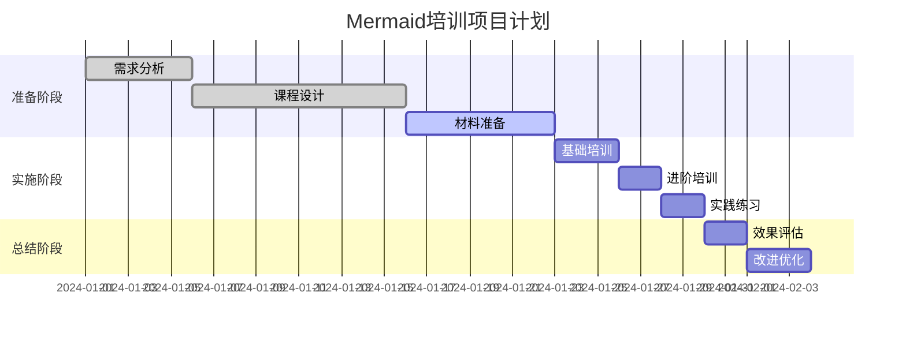

#### 练习任务
1. 制作个人学习计划甘特图
2. 创建项目时间表
3. 设计工作安排图

### 3.4 看板图（Kanban）使用（30分钟）

#### 看板图基础语法

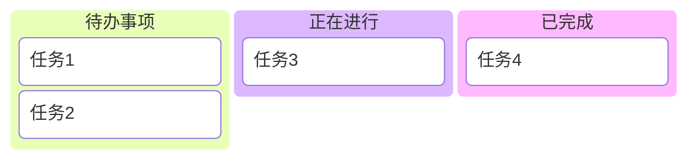

#### 高级功能
- 任务元数据添加
- 优先级设置
- 负责人分配
- 截止日期标注

#### 实际案例：学习任务管理

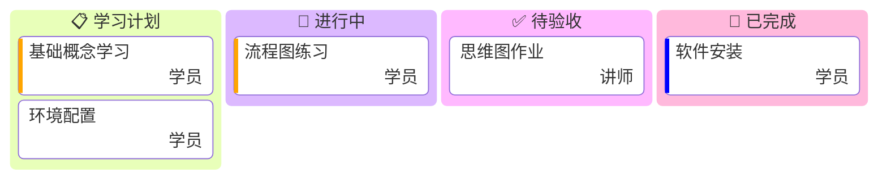

#### 练习任务
1. 创建个人任务看板
2. 设计团队协作看板
3. 制作项目进度看板

## 第四阶段：高级功能应用（105分钟）

### 4.1 子图（Subgraph）构建（40分钟）

#### 子图语法基础

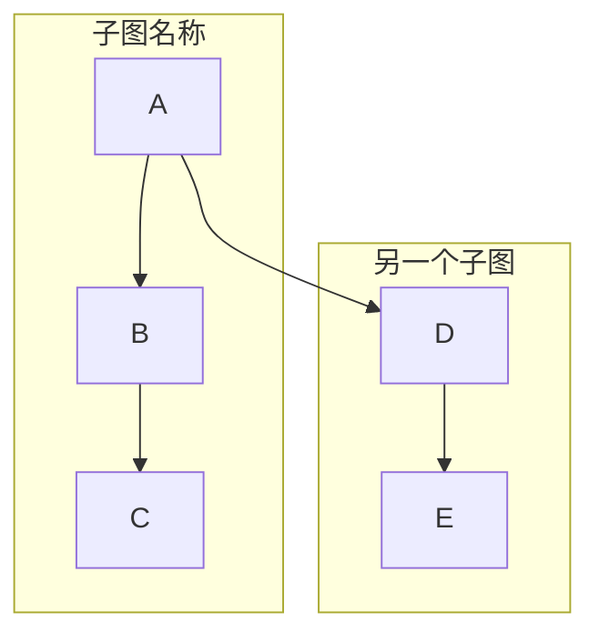

#### 嵌套子图
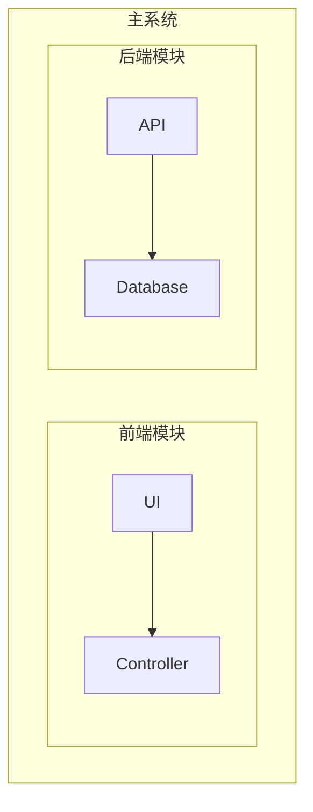

#### 实际案例：系统架构图

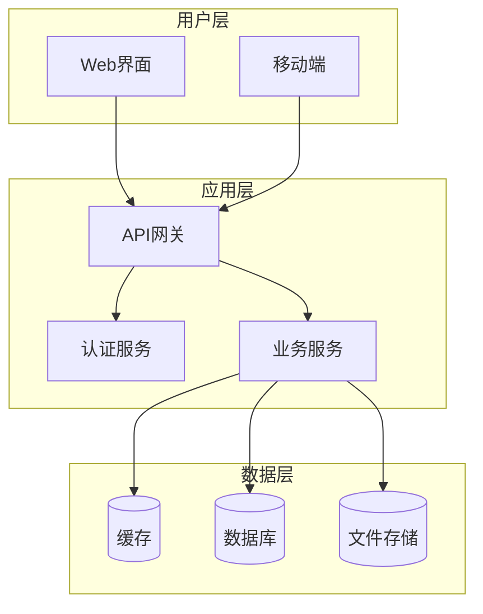

### 4.2 样式定制与美化（35分钟）

#### 内联样式
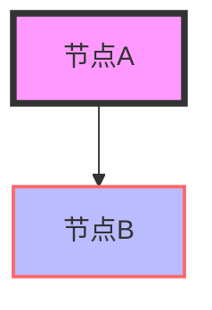

#### 类样式定义
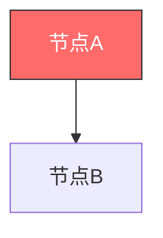

#### 主题配置
- 默认主题选择
- 自定义配色方案
- 字体样式调整

### 4.3 交互功能添加（30分钟）

#### 点击事件
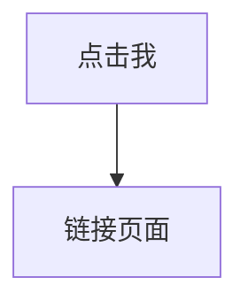

#### Obsidian内链
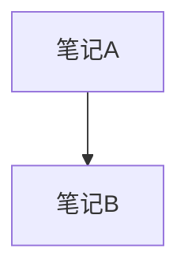

## 第五阶段：最佳实践（80分钟）

### 5.1 图表设计基本原则（30分钟）

#### 设计原则
1. **简洁明了**：避免过度复杂
2. **逻辑清晰**：保持流程合理
3. **视觉平衡**：注意布局美观
4. **信息完整**：包含必要信息

#### 常见误区
- 节点过多导致混乱
- 连接关系不明确
- 缺乏层次结构
- 颜色使用不当

### 5.2 性能优化技巧（25分钟）

#### 优化策略
- 控制图表规模
- 合理使用子图
- 减少不必要的样式
- 优化渲染参数

### 5.3 版本管理最佳实践（25分钟）

#### 版本控制
- 使用Git管理图表代码
- 建立图表模板库
- 维护更新日志
- 团队协作规范

## 第六阶段：实际项目应用（150分钟）

### 6.1 工作流程图设计（60分钟）

#### 业务流程梳理
1. 流程调研分析
2. 关键节点识别
3. 决策点确定
4. 异常处理路径

#### 实践项目：客户服务流程
设计完整的客户服务处理流程图，包含：
- 客户问题接收
- 问题分类处理
- 解决方案实施
- 结果反馈跟踪

### 6.2 项目管理图表应用（45分钟）

#### 项目管理场景
- 项目启动流程
- 风险管理矩阵
- 资源分配图表
- 进度跟踪看板

#### 实践项目：软件开发项目
创建软件开发项目的完整管理图表集，包含：
- 开发流程图
- 项目甘特图
- 任务看板
- 团队协作图

### 6.3 个人知识整理方法（45分钟）

#### 知识管理应用
- 学习路径规划
- 知识体系构建
- 技能发展追踪
- 目标达成监控

#### 实践项目：个人成长体系
建立个人知识管理和成长追踪体系，包含：
- 技能发展思维图
- 学习计划甘特图
- 目标追踪看板
- 知识关联网络

## 课程总结与进阶建议

### 学习成果检验
- 能够独立创建各类Mermaid图表
- 掌握在Obsidian中的集成应用
- 具备图表设计和优化能力
- 能够解决实际工作中的可视化需求

### 进阶学习方向
1. **深入学习特定图表类型**
2. **探索高级配置选项**
3. **与其他工具的集成应用**
4. **团队协作和分享机制**

### 持续改进建议
- 定期更新知识和技能
- 关注Mermaid新功能发布
- 参与社区交流和分享
- 建立个人图表模板库

## 附录

### A. 常用语法速查表
（详细的语法参考表格）

### B. 实用模板集合
（各种场景的图表模板）

### C. 问题排查指南
（常见问题及解决方案）

### D. 资源推荐
- 官方文档链接
- 社区资源
- 相关工具推荐
- 学习资料汇总

---

**课程版本**：v1.0  
**更新日期**：2024年12月  
**适用版本**：Obsidian 1.4+ / Mermaid 10.0+