# Mermaid (万能图形) 协议切片
## 1. 专家灵魂 (The Soul)

### 基于文本的万能建模工具 (Mermaid Engine)
Mermaid 是一种基于文本的绘图工具，旨在通过简单的标记语言，快速构建、迭代和分享复杂的逻辑结构图。它是从“感性思维”向“结构化逻辑”转化的桥梁。

#### 核心分类视角：
- **逻辑流转类**: 获取业务流转、决策树及闭环逻辑 (`flowchart`, `stateDiagram-v2`)。
- **时序交互类**: 刻画系统组件间的协作、调用链与消息传递 (`sequenceDiagram`)。
- **结构建模类**: 描述系统架构、数据模型、组织关系 (`erDiagram`, `classDiagram`, `architecture`)。
- **计划与追踪类**: 专注于时间维度、进度管理及任务分配 (`gantt`, `kanban`, `timeline`)。
- **多维认知类**: 用于发散性思维梳理、体验感知分析及比例展示 (`mindmap`, `journey`, `pie`)。

### 公共事项及说明 (Common Instructions)
1. **纯净 DSL 范式**: AI 必须生成纯文本 DSL 指令。严禁将代码块包裹在 JSON 结构中或附加冗余解释。
2. **符号冲突防御**: 在中文描述文字中，**必须优先使用中文全角标点**（如 `，`、`；`、`：`）。严禁在未经过 `""` 或 `[]` 包裹的文本中出现半角逗号 `,` 或分号 `;`，以防止被解析器误认为语法分隔符。
3. **复杂内容包裹**: 凡是包含空格、特殊符号或多行文本的节点，**必须**使用 `["内容"]`（矩形）、`("内容")`（圆角）或 `{{ "内容" }}`（六角）进行显式包裹。

### 分类图表注意事项 (Diagram-Specific Precautions)

| 图表类型 | 核心约束与避坑指南 |
| :--- | :--- |
| **甘特图 (Gantt)** | **缩放防御**: 若当前日期不在项目周期内，必须强制设置 `todayMarker off`，否则时间轴会被无限拉伸导致图例不可见。 |
| **状态图 (State)** | **语义固化**: 必须采用 `state "描述文本" as 别名` 语法。严禁直接在转移连线上书写过于复杂的逻辑描述。 |
| **架构图 (Architecture)** | **拓扑语法**: 连线方向必须遵循 `源节点:方向 --> 方向:目标节点`（如 `gateway:R --> L:auth`）。Label 建议优先使用英文。 |
| **需求图 (Requirement)** | **关系严谨**: 关系连接必须带箭头（如 `- satisfies ->`）。验证方法必须使用关键字 `verifyMethod`。 |
| **实验性图表 (Beta)** | **引号强制**: 在 `sankey-beta`, `quadrantChart`, `block-beta`, `xychart-beta` 中，**所有中文标签必须用双引号 `""` 包裹**。 |
| **桑基图 (Sankey)** | **语言退避**: 当前版本 `sankey-beta` 解析器对非 ASCII 字符极其敏感，**建议强制使用英文标注**以确保渲染成功。 |

---

## 2. 语法血肉 (The Flesh)

### 全量图表关键字定义
| 分类 | 关键字 | 典型语法结构 |
| :--- | :--- | :--- |
| **流程图** | `graph` / `flowchart` | `A[节点] --> B{判断}` |
| **时序图** | `sequenceDiagram` | `Alice ->> Bob: 消息` |
| **甘特图** | `gantt` | `section [阶段]\n 任务 :a1, 2024-01-01, 5d` |
| **状态图** | `stateDiagram-v2` | `[*] --> State1\n State1 --> [*]` |
| **类图** | `classDiagram` | `class A { +attr }` |
| **饼图** | `pie` | `title [标题]\n "项" : 50` |
| **ER图** | `erDiagram` | `ENTITY ||--o{ OTHER : rel` |
| **旅程图** | `journey` | `section [阶段]\n 步骤: 5: [角色]` |
| **思维导图** | `mindmap` | `root(("中心"))\n  分支` |
| **时间线** | `timeline` | `2024 : [事件]` |
| **看板图** | `kanban` | `[列名]\n  [事项] @{ assigned: "人" }` |
| **架构图** | `architecture` | `group 组名\n service 服务名` |

### 视觉初始化指令 (Directives)
使用 `%%{init: {...}}%%` 定义全局风格：
- `theme`: `default`, `forest`, `dark`, `neutral`, `base`。
- `look`: `handDrawn` (手绘效果)。
- `layout`: `elk` (针对复杂大图的算法优化)。

---

## 3. 官方示例 (The Seed)

### 1. 业务流程 (Flowchart)
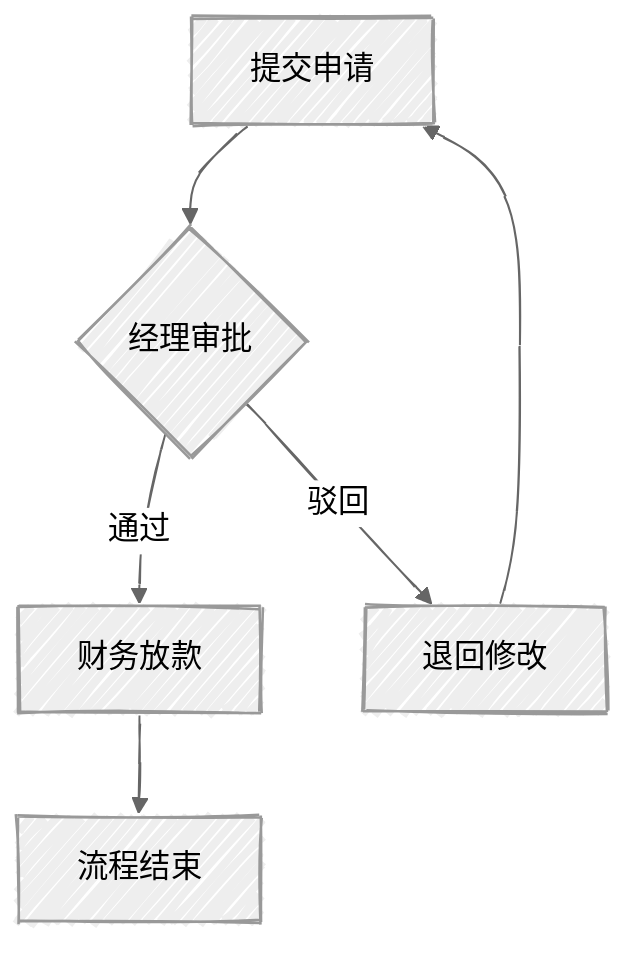

### 2. 时序调用 (Sequence)
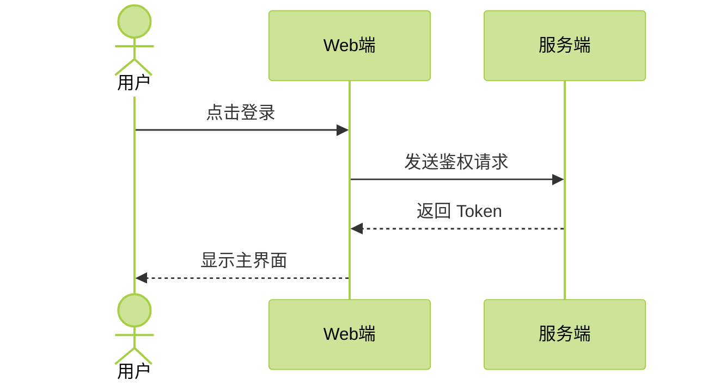

### 3. 计划排期 (Gantt)
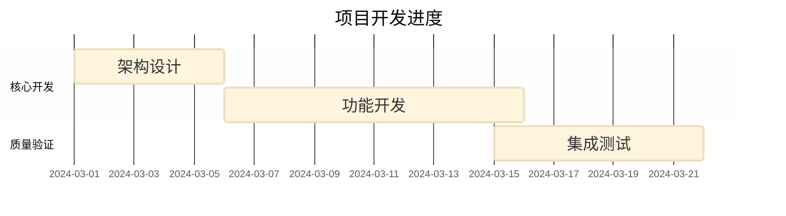

### 4. 状态流转 (State)
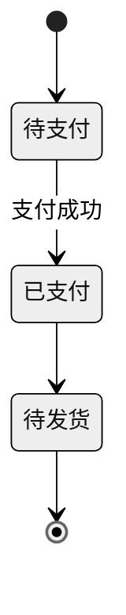

### 5. 比例展示 (Pie)
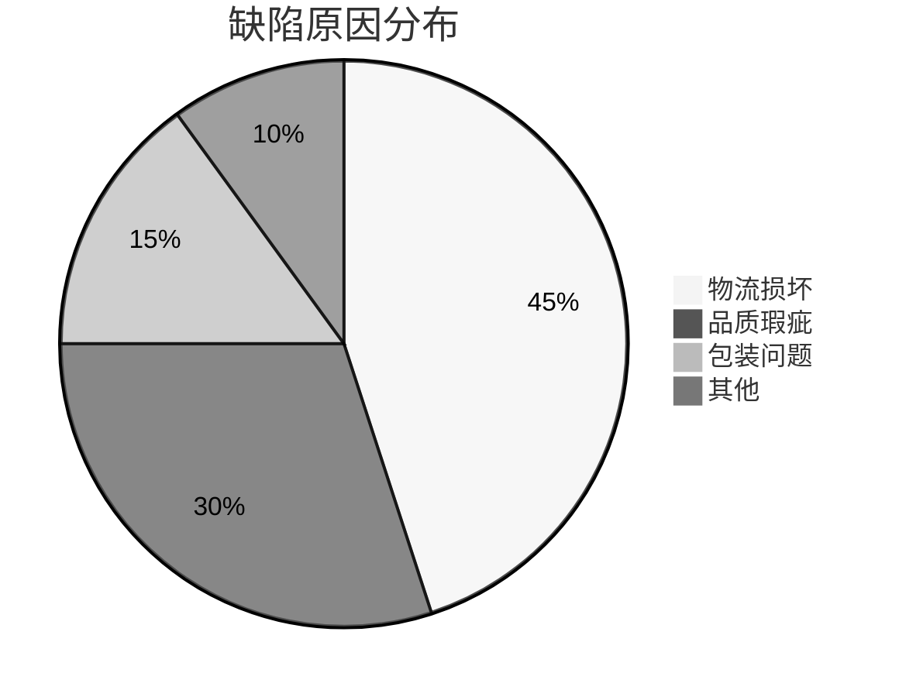

### 6. 数据建模 (ER)
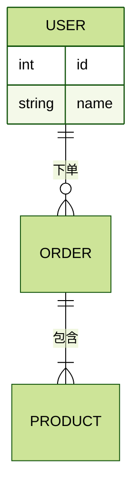

### 7. 系统结构 (Class)
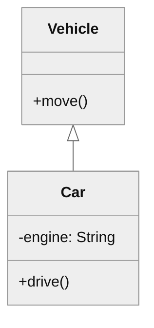

### 8. 体验路径 (Journey)
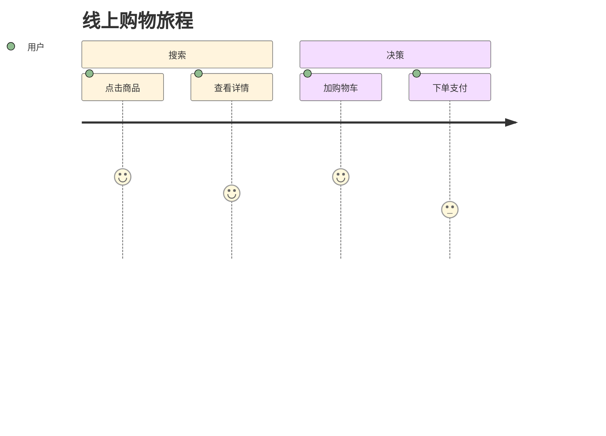

### 9. 知识脑图 (Mindmap)
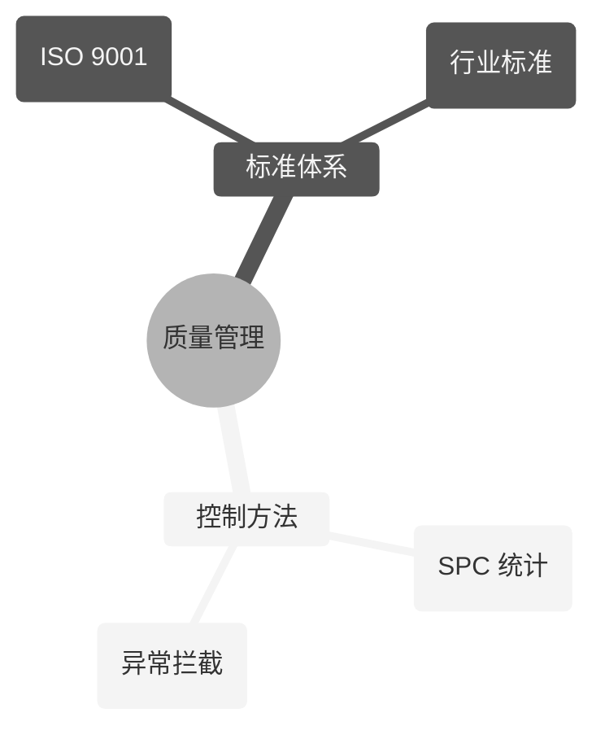

### 10. 历史年表 (Timeline)
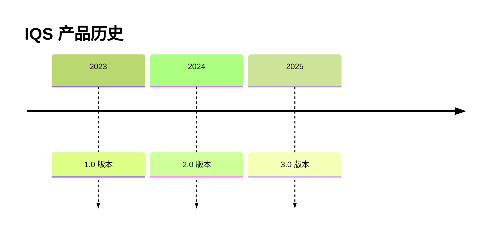

### 11. 任务看板 (Kanban)
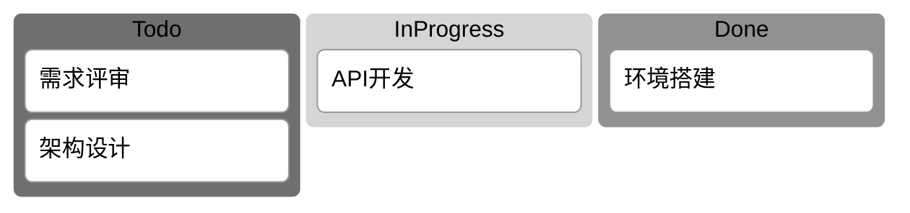

### 12. 架构拓扑 (Architecture)
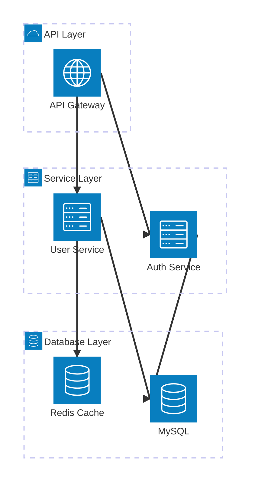

### 13. Git 分支流转 (GitGraph)
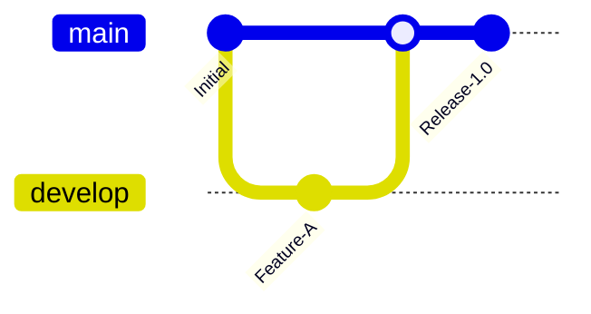

### 14. 能量/价值流向 (Sankey)
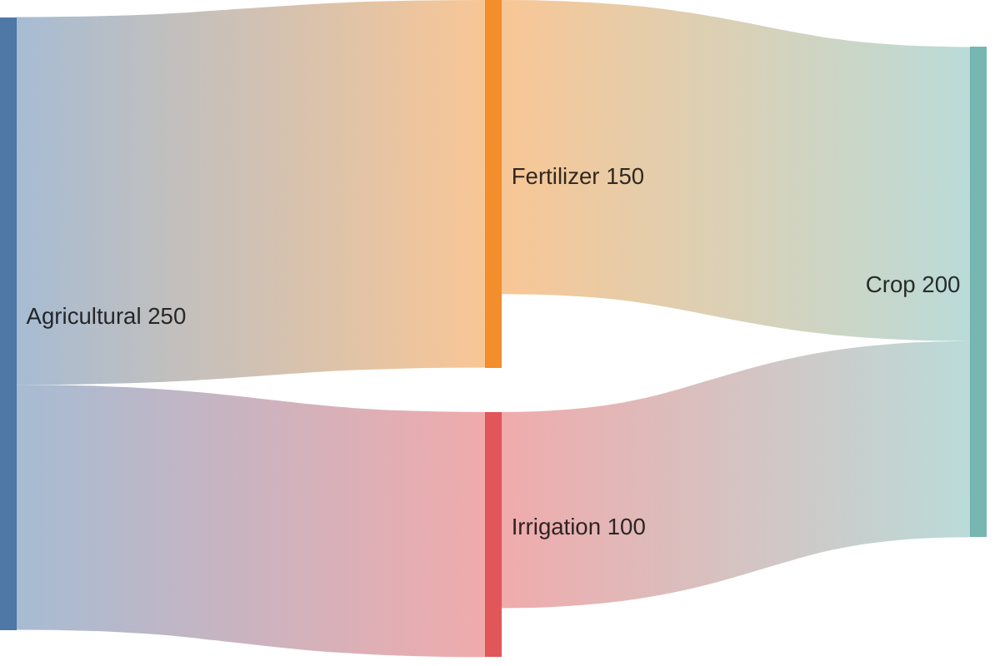

### 15. 系统需求建模 (Requirement)
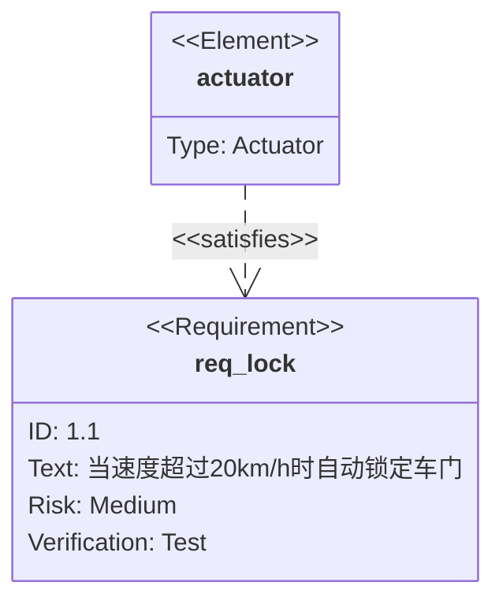

### 16. 四象限评估 (Quadrant)
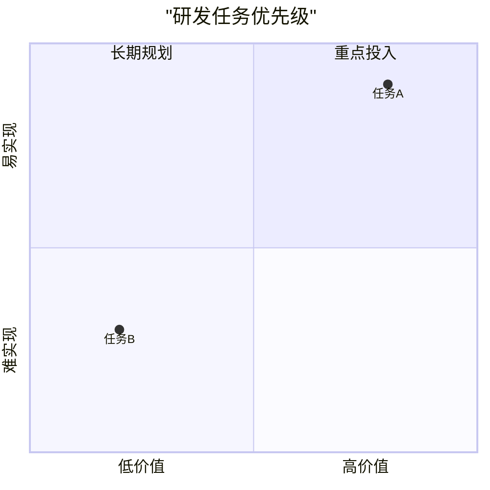

### 17. 通用 XY 组合 (XYChart)
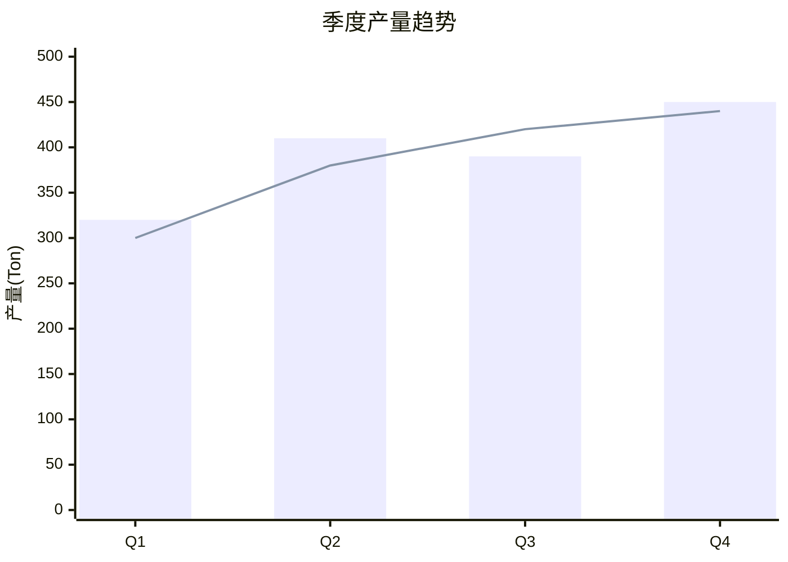

### 18. 分层块图结构 (Block)
```mermaid
block-beta
    columns 3
    "服务1" "服务2" "服务3"
    block:group1
        columns 1
        "子项A" "子项B"
    end
```

### 19. 报文协议解析 (Packet)
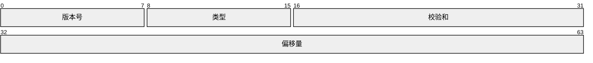

---
**权威性声明**: 本文档内容与 `MermaidEditor.tsx` 及 `chart_spec.json` 保持同步。 Riverside,
