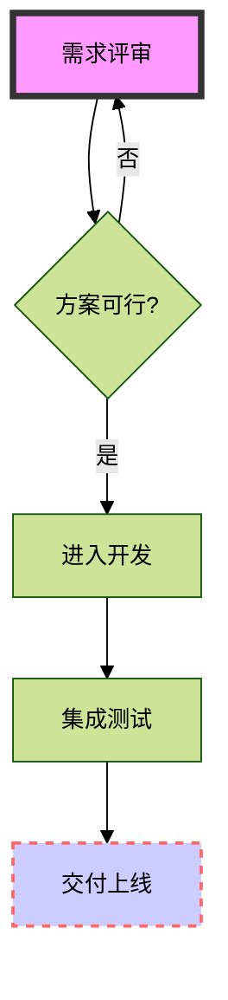

# Mermaid (万能图形) 协议切片

## 1. 专家灵魂 (The Soul)

### 基于文本的万能建模工具 (Mermaid Engine)
Mermaid 是一种基于 JavaScript 的绘图工具，能够将类似 Markdown 的文本转换为复杂的图表。

#### 核心逻辑与多维适配：
- **流程图 (Flowchart)**: 解决节点流转与逻辑决策问题，支持自上而下 (TD) 与左右开弓 (LR)。
- **思维导图 (Mindmap)**: 专注于发散性思维与知识树状梳理。
- **序列图 (Sequence)**: 刻画对象间的时序交互与消息闭环。
- **看板图 (Kanban)**: 任务状态的可视化追踪。
- **项目管理 (Gantt)**: 带有时间轴特性的进度排期。

### 专家建议
> [!IMPORTANT]
> **布局优化**: 对于特别复杂的图形，建议启用 `ELK` 布局引擎。它能通过更高级的算法减少线条交叉，提升大图的可读性。

---

## 2. 语法血肉 (The Flesh)

### 样式与指令 (Directives)
Mermaid 支持通过 `%%{init: {...}}%%` 指令注入全局样式配置。
- `theme`: 可选 `default`, `forest`, `dark`, `neutral`, `base`。
- `look`: 手绘模式开关 (`handDrawn`)。
- `layout`: 布局引擎开关 (`elk`)。

### 核心语法速记
| 类型 | 关键字 | 核心语法示例 |
| :--- | :--- | :--- |
| 流程图 | `graph TD/LR` | `A[开始] --> B{判断}` |
| 思维导图 | `mindmap` | `root((中心))\n  分支` |
| 序列图 | `sequenceDiagram` | `Alice->>Bob: 消息` |
| 看板图 | `kanban` | `[待办]\n  [任务] @{ assigned: "张三" }` |
| 甘特图 | `gantt` | `title 进度\n section 阶段\n 任务 :a1, 2024-01-01, 3d` |

---

## 3. 官方示例 (The Seed)

### 场景：综合交付流程 (流程图 + 样式指令)

---
**权威性声明**: 本文档内容与 `MermaidEditor.tsx` 及 `chart_spec.json` 保持同步。 Riverside,
